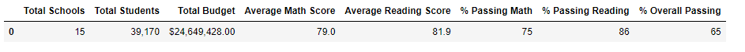
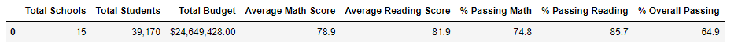
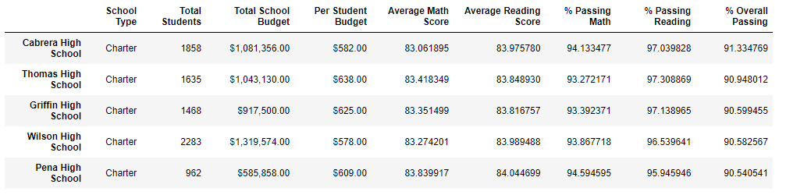
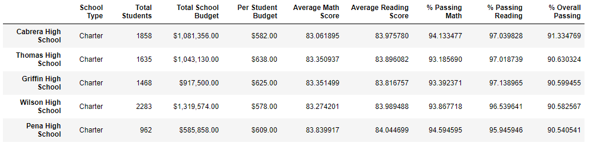

# School_District_Analysis

##Overview of Project
###The analysis of a school district and their standardized test scores to show performance and school trends. The result of this analysis will allow the school board to make decisions on the school budget what need to be done.

### The Analysis should include the following information:

  1. Perform data cleaning to exclude reading and math grades for Thomas High School ninth graders due to possible academic dishonesty (records appear to have been altered)
  2. A High-level snapshot of the district's key metrics, presented in a table format
  3. An overview of the key metrics for each school, presented in a table format
     The analysis report will include tables presenting each of the following metrics:

### Top 5 and bottom 5 performing schools, based on the overall passing rate
    - The average math score received by students in each grade level at each school
    - The average reading score received by students in each grade level at each school
    - School performance based on the budget per student
    - School performance based on the school size
    - School performance based on the type of school
    
## Resources
    - Data Source: schools_complete.csv; students_complete.csv
    - Source Code: PyCitySchools_Challenge
    - Software: Python 3.7.9 64-bit (conda); jupyter-notebook : 6.1.4
    
## Results
- *How is the district summary affected?*

   - There is no change to any value under district summary.

   ***Original District Summary***
   
   
   
   
   ***Updated District Summary (after replacing 9th grades with NaN values for THS)***
   
   

- *How is the school summary affected?*

   - The average math score for Thomas High School went down slightly (from 83.42 to 83.35).
   - The passing math % for Thomas High School went down slightly (from 93.27 to 93.19).
   - The average reading score for Thomas High School slightly increased (from 83.85 to 83.90).
   - The passing reading % for Thomas High School decreased slightly (from 97.27 to 97.02).
   - The overall passing % for Thomas High School decreased very slightly (from 90.95 to 90.63).
   - Nothing else was affected.
   
   
   ***Original School Summary***
   
   
   
   
   ***Updated School Summary w/o THS***
   
   
   
 - *How does replacing the ninth graders’ math and reading scores affect Thomas High School’s performance relative to the other schools?*
   - The performance % decreases is only 0.5% (from 90.95% to 90.63%) .
   - The difference in overall performance % does not affect the schools standing.
   - Thomas High School remains the 2nd top performing school.
   
- **How does replacing the ninth-grade scores affect the following:**

- *Math and reading scores by grade*
   - The replacing of Thomspon High School 9th grade scores with "NaN" does not affect any other data or scores. 
   
- *Scores by school spending*
   - The School spending category Thomas High School falls into (**$630-644**) is not affected.
   
- *Scores by school size*
   - The school size category Thomas High School falls into (**Medium(1000-2000)**) is not affected.
   
- *Scores by school type*
   - The charter schools category Thomas High School falls into is not affected.
    
### School District Data Analysis Summary:
The four major changes in the updated school district analysis after THS 9th grade scores were replaced with "NAN":

   - The performance % decreases is 0.5% (from 90.95% to 90.63%).
   - No scores are available for 9th grade for Thomas High School.
   - The passing math % for Thomas High School went down slightly (from 93.27 to 93.19).
   - The passing reading % for Thomas High School decreased slightly (from 97.27 to 97.02).
